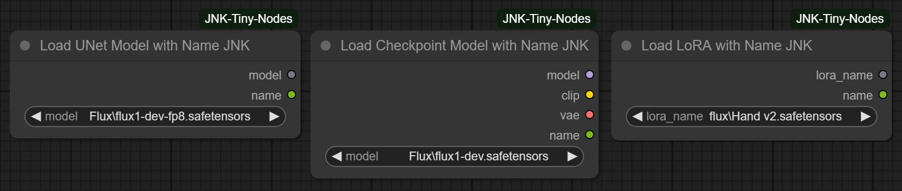
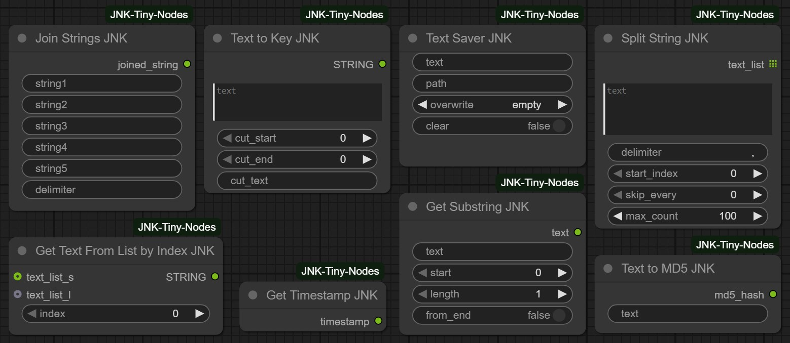

# ComfyUI-JNK-Tiny-Nodes

A collection of useful custom nodes for ComfyUI - image processing, text manipulation, and workflow automation.


## 📦 Installation

You can access it directly from the ComfyUI Manager. Search for "JNK," click "Install," and then restart.

OR

### Method 1: Git Clone (Recommended)
```bash
cd ComfyUI/custom_nodes/
git clone https://github.com/Aljnk/ComfyUI-JNK-Tiny-Nodes.git
```

### Method 2: Manual Download
1. Download the repository as ZIP
2. Extract to `ComfyUI/custom_nodes/ComfyUI-JNK-Tiny-Nodes/`


## 🔧 Dependencies

```bash
# Required Python packages
pip install opencv-python
pip install pygame
pip install google-genai
```


## 🔄 Changelog

### v1.1.4 (September 10, 2025)
- Added "ToonOut Remove BG" node - advanced background removal using fine-tuned BiRefNet model.
- Model file: `birefnet_finetuned_toonout.pth`
- Download: [HuggingFace - joelseytre/toonout](https://huggingface.co/joelseytre/toonout/blob/main/birefnet_finetuned_toonout.pth)
- Installation: Place model file in `ComfyUI/models/RMBG/ToonOut/` folder
- Example workflow included in `example_workflows/01_ToonOut.json`

### v1.1.3 (July 14, 2025)
- Added "Split String" node for advanced text splitting. Fixed minor bugs.

### v1.1.2 (July 12, 2025)
- Added 2 utility nodes to enhance "Ask Google Gemini" workflow.

<details>
<summary>Show older updates</summary>

### v1.1.1 (July 10, 2025)
- Added "Prepare Image for AI" node for optimizing images before sending to AI models (token saving).

### v1.1.0 (July 8, 2025)
- Added "Ask Google Gemini" node for text and image AI processing.

### v1.0.0 (June 4, 2025)
- Initial release.
- 25+ custom nodes.

</details>


## 📋 Nodes

### Models
- **Load UNet Model with Name** - Return UNet model and model name. The name can be used when saving files to understand which model was used in creation.
- **Load Checkpoint Model with Name** - Return components of a checkpoint model and its name. The name can be used when saving files to understand which model was used in creation.
- **Load LoRA with Name** - Return LoRA model and LoRA name. The name can be used when saving files to understand which LoRA was used in creation.

<div align="center"></div>

### Video
- **Save Frame** - Save individual frames with sequential numbering. Useful for extracting specific frames from video for processing.
- **Save Video Images** - Batch save multiple images as numbered sequence. Allows decomposing video into images, modifying some frames, then reassembling into video.

<div align="center"></div>

### Image
- **Save Static Image** - Save images with quality control, metadata, and an option to skip existing files. Allows saving images using filesystem paths.
- **Load Image if Exist** - Load images with existence check, returning a boolean status. Loads image by filesystem path and returns boolean to check if image was loaded.
- **Image Filter Loader** - Batch load images from folders with filtering + returns number of found images and their paths. Loads images from a folder whose names contain the filter keyword.
- **Prepare Image for AI** - Optimize images (reduce image size) to save tokens when using with "Ask Google Gemini" node for computer vision tasks.
- **Stroke RGBA Image** - Add customizable stroke effects to RGBA images or by mask. Preserves alpha channel after stroking.
- **Create RGBA Image** - Generate transparent or colored RGBA image. Useful for compositing images from different layers.
- **Add Layer Overlay** - Composite layers with positioning, rotation and opacity control.
- **Get One Alpha Layer** - Extract the largest alpha region from images.
- **Get All Alpha Layers** - Extract all significant alpha regions while preserving smaller details.
- **ToonOut Remove BG** - Advanced background removal using fine-tuned BiRefNet model. 

<div align="center"></div>

### Upscale
- **Topaz Photo Upscaler** - Integrate with Topaz Photo AI for professional upscaling with autopilot settings. Compression parameter controls PNG compression after upscaling. tpai_exe specifies path to folder containing tpai.exe file. For custom settings, configure AutoPilot mode in Topaz Photo AI preferences.

<div align="center"></div>

### Text
- **Get Text From List by Index** - Extract specific text items from lists or string lists by index position.
- **Text Saver** - Save text to file by path. Useful for saving translations or configuration sets.
- **Get Substring** - Extract substrings with start position, length and reverse options. Useful for trimming long model names when saving results.
- **Text to Key** - Convert text to key. Cuts beginning and end of text to create keys from these parts.
- **Text to MD5** - Generate MD5 hashes from text for unique identifiers.
- **Join Strings** - Concatenate multiple strings with custom delimiters. Text can be written directly in the node.
- **Split String** - Split text by delimiter with start position, skip patterns, and count limits.
- **Get Timestamp** - Generate current timestamp strings for file naming.

<div align="center"></div>

### Logic
- **Switch Integer** - Convert ON/OFF states to 1/0 integers for conditional logic.
- **Switch Index** - Convert ON/OFF states to 2/1 indices for node switching.
- **Get Models** - Get model list by search key. In test mode, uses next model from list each run (very convenient for model testing). In work mode, uses only model from model_name or first in list.

<div align="center"></div>

### System
- **Bridge All** - Simple bridge with main parameters.
- **Queue Stop** - Stop processing with optional sound alerts and queue clearing.
- **Create Folder** - Create directory by path programmatically.

<div align="center"></div>

### API
- **Ask Google Gemini** - Send a text prompt (with an optional image) to the Google Gemini AI model. When the RPM is greater than 0, the node will pause between requests to maximize request throughput while staying within rate limits. Get a [free API key](https://aistudio.google.com/apikey). [Available models](https://ai.google.dev/gemini-api/docs/models). [Free tier RPM limits](https://ai.google.dev/gemini-api/docs/rate-limits#free-tier).
- **Get Gemini Keys** - Load up to 5 Google Gemini API keys from a text file. Each key should be on a separate line. Useful for rotating between multiple API keys to manage rate limits.
- **Get Gemini Models** - Configure and manage different Gemini models (Pro, Flash, Light) with their respective RPM (requests per minute) settings.

<div align="center"></div>


## ⚙️ Special Requirements

### ToonOut Remove BG
**Requirements:**
- Model file: `birefnet_finetuned_toonout.pth`
- Download: [HuggingFace - joelseytre/toonout](https://huggingface.co/joelseytre/toonout/blob/main/birefnet_finetuned_toonout.pth)
- Installation: Place model file in `ComfyUI/models/RMBG/ToonOut/` folder

**Example Workflow:**
<div align="center"></div>


## 📄 License

This project is licensed under the MIT License - see the [LICENSE](LICENSE) file for details.


## 📞 Support

- **Issues**: [GitHub Issues](https://github.com/Aljnk/ComfyUI-JNK-Tiny-Nodes/issues)


## ☕ Support the Author

If you find these nodes helpful, consider buying me a coffee:

- **Ko-fi**: [ko-fi.com/alexjnk](https://ko-fi.com/alexjnk)
